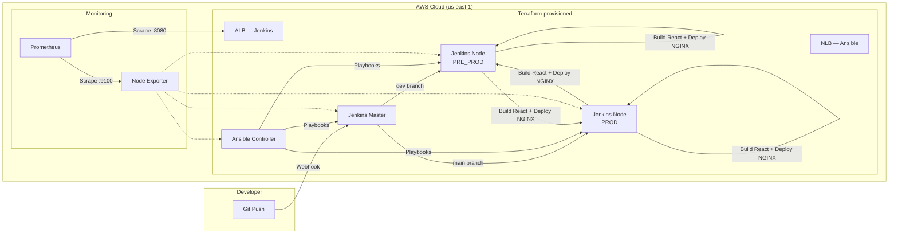

# AWS DevOps Automation

> End-to-end DevOps platform on AWS combining Terraform infrastructure provisioning, Ansible configuration management, Jenkins CI/CD pipelines, and Prometheus monitoring to deploy a React dashboard application.


## Architecture



## Features

- **Terraform modules** for VPC, security groups, and EC2 instances (Jenkins + Ansible)
- **Ansible roles** for Jenkins installation, user management, security hardening, and common setup
- **Jenkins pipeline** with branch-based deployment (dev → pre-production, main → production)
- **React dashboard** (devops-dashboard) built and deployed via Jenkins to NGINX
- **Prometheus monitoring** with Node Exporter on all servers and Jenkins metrics via ALB
- **Infrastructure automation scripts** for quick provisioning and teardown

## Tech Stack

| Category | Technology |
|----------|-----------|
| Infrastructure | Terraform (AWS VPC, EC2, ALB, NLB) |
| Configuration | Ansible (roles, playbooks, inventory) |
| CI/CD | Jenkins (declarative pipeline) |
| Application | React 18 (devops-dashboard) |
| Web Server | NGINX |
| Monitoring | Prometheus + Node Exporter |
| Cloud | AWS (us-east-1) |

## Getting Started

### Prerequisites

- Terraform >= 1.0
- Ansible >= 2.9
- AWS CLI configured
- SSH key pair for EC2 access

### Installation

```bash
git clone https://github.com/g-holali-david/aws-devops-automation.git
cd aws-devops-automation

# 1. Provision infrastructure
cd terraform
terraform init && terraform apply

# 2. Configure servers with Ansible
cd ../ansible-devops
ansible-playbook -i inventory/hosts.ini playbooks/site.yml

# 3. The Jenkins pipeline handles the rest automatically on push
```

### Usage

```bash
# Quick deploy script
./scripts/quick-deploy.sh

# Run Ansible playbooks individually
ansible-playbook -i inventory/hosts.ini playbooks/jenkins.yml
ansible-playbook -i inventory/hosts.ini playbooks/setup_users.yml

# Access Jenkins via ALB
# Access Prometheus at http://<prometheus-ip>:9090
```

## Project Structure

```
aws-devops-automation/
├── Jenkinsfile                    # CI/CD pipeline (branch → env mapping)
├── terraform/
│   ├── main.tf                    # Root module (networking, security, compute)
│   ├── variables.tf / outputs.tf
│   ├── providers.tf
│   ├── modules/
│   │   ├── networking/            # VPC, subnets, IGW
│   │   ├── security/              # Security groups (Jenkins, Ansible)
│   │   └── compute/               # EC2 instances
│   └── scripts/                   # init.sh, destroy.sh
├── ansible-devops/
│   ├── ansible.cfg
│   ├── inventory/hosts.ini
│   ├── group_vars/                # all.yml, jenkins.yml
│   ├── playbooks/                 # site.yml, jenkins.yml, setup_users.yml
│   └── roles/
│       ├── common/                # Base packages
│       ├── security/              # Firewall, SSH hardening
│       ├── jenkins/               # Jenkins install + config
│       └── ansible_user/          # Ansible user provisioning
├── devops-app/                    # React dashboard application
│   ├── package.json
│   ├── src/
│   └── public/
├── monitoring/
│   └── prometheus.yml             # Scrape configs (Jenkins, Node Exporter)
└── scripts/
    └── quick-deploy.sh
```

## Author

**Holali David GAVI** — Cloud & DevOps Engineer
- Portfolio: [gholalidavid.com](https://gholalidavid.com)
- GitHub: [@g-holali-david](https://github.com/g-holali-david)
- LinkedIn: [Holali David GAVI](https://www.linkedin.com/in/holali-david-g-4a434631a/)

## License

MIT
